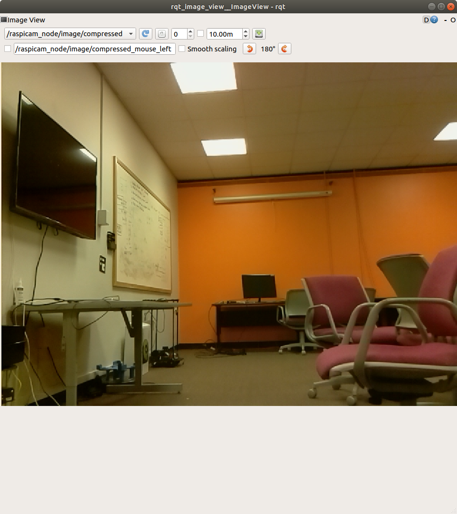
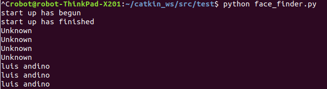

# FacialArm

Adding Luis' project first with my installation guide here:

import face_recognition
import cv2

I will rewrite my startup script to launch a python file named arm commander, so the bash script doesn't have to be changed

**Installation Guide:**

`pip install face_recognition` 

`pip install opencv-python` (takes ~20 minutes)

**Running Guide**

1. be in outermost file

2. run bu shortcut on a robot

3. run roslaunch turtlebot3_bringup turtlebot3_rpicamera.launch framerate:=20 (didn't work on my computer)

4. `rqt_image_view` and select the compressed file you should see this

   This will show

   5) python face_finder.py, and the program will print out 

   

**Notebook Log**

Jacob Smith 12/7/2019 18:42: Making a Repostiroy to hold a combine dproject of Facial Recognition and Arm Interface Cosi 119 Fall 2019 Brandeis University.

19:29: Luis' program works on my computer, printing out his name if he is front of camera, unknown if I am in front of camera, and doesn't rpint if a person isn't there. There is about a ten second lag on this computer.git 

19:43: I made sure necessary files from my project are imported, and catkin make passes.

20:14 I removed subscriber node, mafe publisher node generic, making director of mutantStartup generic.  I also worked with Luis to make the arm_commander python node which reads the current face ros topic and publishes an arm command. The challenge is converting a data stream of current face into a set of commands for the arm that give the arm enough time to move. The current idea is to only set a new command every 4 seconds, which is clunky.  Future work: Show that Luis and my program work together and make a demo video.

12/15/2019 14:12 Luis is writing a node to clean up face recognition, then we will write a timer to request an arm motion every 4 seconds. I'm going to make sure the current repo can move the arm. 14:28: I'm getting usb cutting out after arm receives a few commands.

15:03: wait for robot to turn on in runRos, making initializeserial a method in topic subscriber (to allow method to be called again if usb isn't plugged in, lead to scope errors), made initiSerial wrapper method for modularity, reordered topic subscription and publication so a callback won't happen until serial is ready.

15:51: Luis wrote the filtering nmode and tells the hand to open if it sees a face. Now we are trying to connect the two projects by having the hand move when a face is seen. I get the arm started up, then Luis starts up the camera and publishes the arm command topic

16:36 I got the arm moving, the usb port was wrong. I am talking to TA about a better USb port selection system than guessing

17:04: Luis and I got the arm waving when a face is seen, see our video below

 